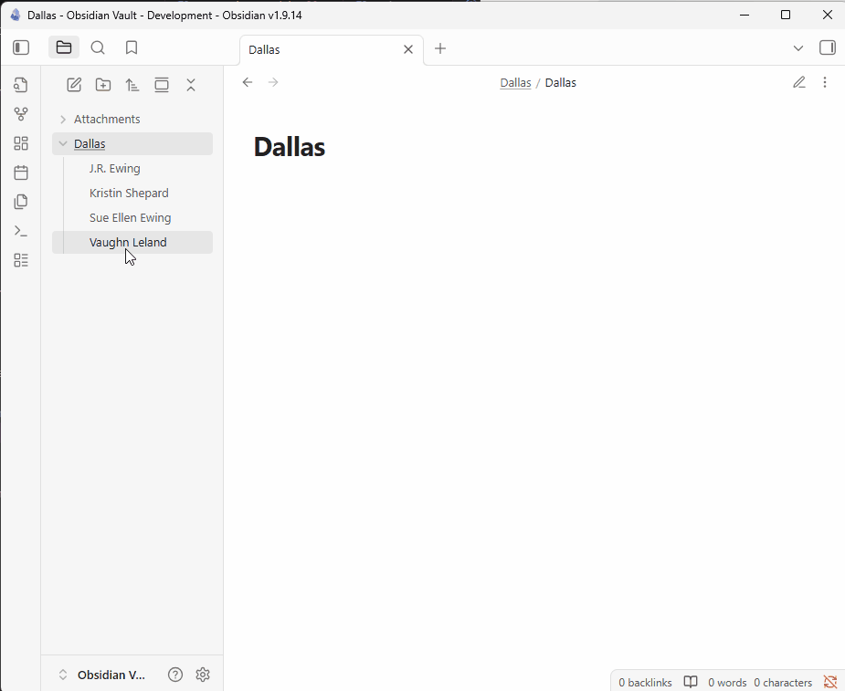

# Obsidian Connections

This plugin allows you to define and view named connections between your notes. 

To add a connection, use the "Connections: Add a connection to another note" command.

In the resulting modal, fill in the type of connection you want to define between the notes and select the target note. Once added, all connections will be displayed in a footer at the bottom of the note view pane.

If you want to delete a connection, click on the (X) button beside the connection you want to remove.

If you want to delete a connection type, click on the (X) button beside the connection type in the 'Add a connection to another note' modal.

This plugin plays nicely with the Folder Notes plugin.

## Demo

## Support

If you have any suggestions on features I could, add please let me know via my [GitHub](https://github.com/evancleve/obsidian-connections)! If you feel like donating some spare change, feel free to do that here: [https://buymeacoffee.com/envancleve](https://buymeacoffee.com/envancleve).